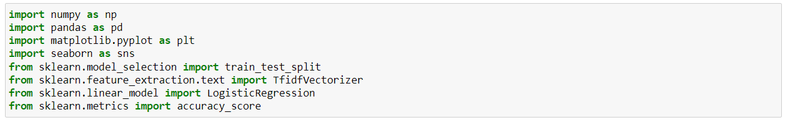

<html>
<body>
<h1>Presentation Of Group 3</h1>
<h2>1. Introduction</h2>

Hi, everyone. Today my team wil present how we collect and analyze data.
Introduction
This is information about Email Spam Collection Dataset, the file contains one email per line. 
Each line is composed by two columns: v1 contains the label (ham or spam) and v2 contains the raw text, which consists of 5,574 email tagged with their respective labels.We collect them here on Kaggle.com. 
The algorithm we use in this topic to process this data is Logistic Regression.
Logistic regression is a supervised learning classification algorithm used to predict the probability of a target variable. It is one of the simplest ML algorithms that can be used for various classification problems such as spam detection
The primary goal is to Classify emails as spam or not and  predict that accurately classifies incoming email either ham or spam.
First, we updated file data to jupyter and type code to have 5 different charts.First chart about the dispersion in the correlation between weight and height of players.

<h2>2. Code and Chart</h2>
<h3>Chart 1: </h3>

Describe chart 1:
I use a pie chart to describe my section . My chart shows that the label 'Ham' makes up the majority (87%) of the dataset, while the label 'Spam' makes up only a small percentage (13%).

<h3>Chart 2: </h3>

Describe chart 2:
The chart represents the frequency of specific words in non-spam messages. It visualizes which words occur most frequently in the non-spam message dataset. The bars on the chart show the relative frequency of each word, with taller bars indicating higher occurrence. 
By examining the chart, one can easily identify the words that are most commonly used in non-spam messages..

<h3>Chart 3: </h3>

Describe chart 3:
The chart represents the frequency of specific words in non-spam messages. It visualizes which words occur most frequently in the non-spam message dataset. The bars on the chart show the relative frequency of each word, with taller bars indicating higher occurrence. 
By examining the chart, one can easily identify the words that are most commonly used in non-spam messages.

<h3>Logistic Regression </h3>
  
  
  
  

<h2>3. Summarize the presentation</h2>

In conclusion, 3 different charts above have filtered out the above data, we know the current status of spam sending in the UK, and we use a Logistic Regression to be able to predict which emails sent in the future are good and which are spam.

</body>
</html>
